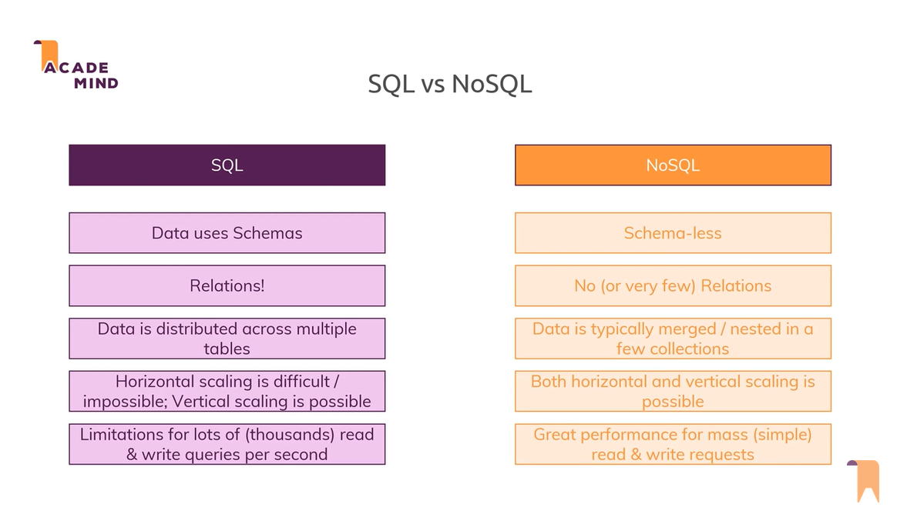

# SQL vs NoSQL: A Comparison of MySQL and MongoDB

**What type of database is the best fit for the complex query intensive environment?**
SQL databases, such as MySQL, are the best fit for complex query-intensive environments. They excel at handling complex queries and managing structured data with predefined relationships between tables.

**What type of database is the best fit for hierarchical data storage?**
NoSQL databases, like MongoDB, are the best fit for hierarchical data storage. They offer a flexible schema design that can easily accommodate hierarchical structures, making them ideal for storing and retrieving data in a hierarchical format.

**Describe the differences in scalability between a SQL and NoSQL database as though you were speaking to a non-technical friend.**
- SQL databases scale vertically by upgrading the resources of a single server. It's like upgrading your computer's hardware to handle more tasks. However, there's a limit to how much a single server can handle.
- NoSQL databases scale horizontally by distributing data across multiple servers. It's like having a team of computers working together to handle a growing workload. You can add more servers as needed to handle increased traffic and data volume.

**Among data tables, what is a one-to-many relationship and how do we “relate” them?**
In data tables, a one-to-many relationship is a type of relationship where a single record in one table can be associated with multiple records in another table. For example, in a database for a school, one teacher can have multiple students. To "relate" them, we typically use a foreign key in the "many" table that references the primary key of the "one" table. This establishes the relationship between the tables and allows us to link the records.

**Prior to designing your relational database, it might be useful to ___ a ___ of the database tables and their relationships.**
Prior to designing your relational database, it might be useful to create a conceptual model of the database tables and their relationships. This can be done using techniques like entity-relationship diagrams (ER diagrams) or by simply sketching out the tables and their connections on paper or a whiteboard. Creating this visual representation helps in understanding the structure of the database and how the tables are related to each other.

**Explain the difference between a primary and foreign key.**
A primary key is a column or a set of columns in a table that uniquely identifies each record in that table. It ensures that each record has a unique identifier within the table and is used to enforce data integrity and provide fast data retrieval.

A foreign key, on the other hand, is a column or a set of columns in a table that refers to the primary key of another table. It establishes a relationship between two tables, where the foreign key in one table refers to the primary key in another table. This relationship helps maintain referential integrity and enables the enforcement of data constraints and integrity rules between the related tables.

**How do we treat keywords and parameters differently in SQL syntax?**
In SQL syntax, keywords are reserved words that have special meanings and are used to define the structure and actions within a query or statement. They are not case-sensitive and are typically written in uppercase. Examples of SQL keywords include SELECT, INSERT, UPDATE, and DELETE.

On the other hand, parameters are values that are passed into a query or statement to customize its behavior or filter the results. Parameters are typically represented by placeholders, such as "?" or ":parameter_name", and their actual values are supplied when executing the query. Parameters help make SQL statements more flexible and secure by allowing dynamic and parameterized queries.

**Define normalization within the context of schemas and data.**
Normalization is the process of organizing data in a database to minimize redundancy and dependency issues. It involves breaking down larger tables into smaller, well-structured tables to eliminate data duplication and ensure data integrity.

In the context of schemas and data, normalization helps in creating efficient and maintainable database designs by following a set of normalization rules. These rules, known as normal forms, define the criteria for structuring data and minimizing data anomalies. By normalizing data, we can reduce data redundancy, improve data consistency, and simplify data manipulation.

**Explain the difference between one-to-one, one-to-many, and many-to-many relationships to a non-technical recruiter.**
- One-to-one relationship: In a one-to-one relationship, one record in one table is related to only one record in another table, and vice versa. It's like having a unique identifier between two individuals. For example, a person can have only one passport, and a passport is issued to only one person.

- One-to-many relationship: In a one-to-many relationship, one record in one table is associated with multiple records in another table, but the records in the second table are related to only one record in the first table. It's like a parent-child relationship. For example, a customer can have multiple orders, but each order belongs to only one customer.

- Many-to-many relationship: In a many-to-many relationship, multiple records in one table are related to multiple records in another table, and vice versa. It's like having a group of people attending multiple events, and each event can have multiple attendees. To represent such relationships in a relational database, an intermediate table, known as a junction or join table, is used to connect the two tables and store the relationships.

